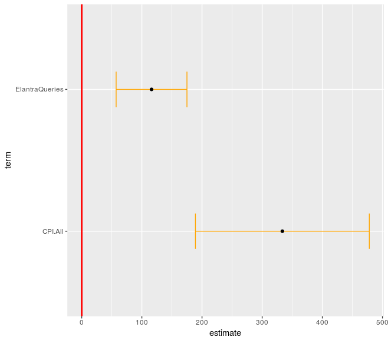
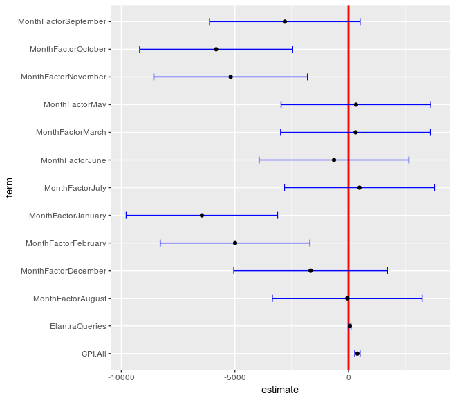
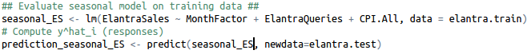
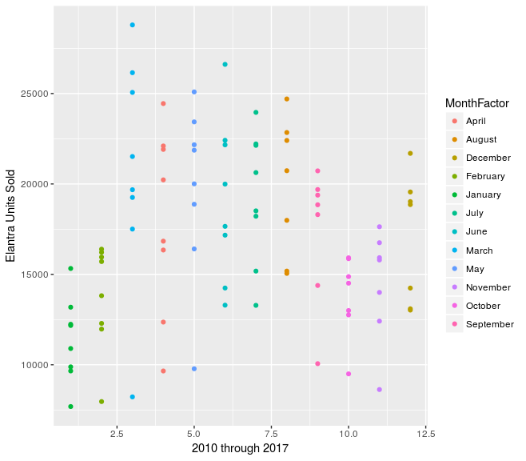
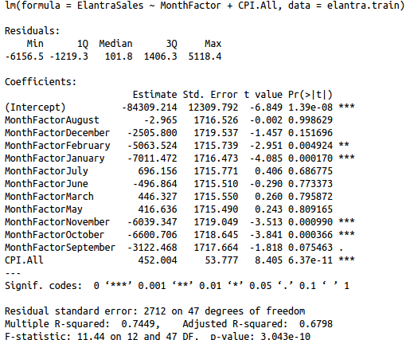
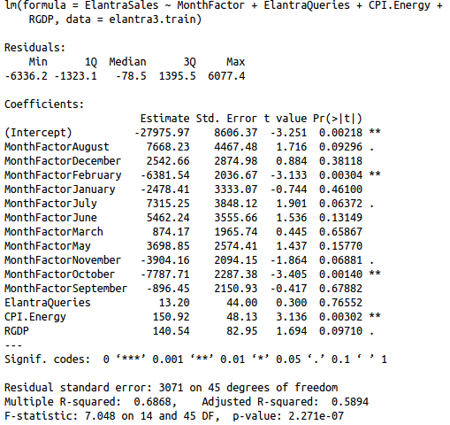

# Forecasting Automobile Sales with Linear Regression in R

**Topic:** Time series forecasting, feature selection, linear regression
**Language:** R
**Level:** Introductory - Intermediate

This repository teaches applied forecasting through a concrete, end-to-end regression project: predicting monthly U.S. sales of the Hyundai Elantra. Starting from raw economic data and Google search query volume, you will build, evaluate, and iteratively refine a series of linear regression models. The project emphasizes why each modeling decision is made - not just what the code does - so that the workflow transfers to any demand-forecasting problem, not only automotive sales.

---

## Learning Objectives

By working through this project you will be able to:

- Split time series data into training and test sets correctly, avoiding data leakage
- Build a linear regression model in R using `lm()`
- Interpret model summaries: coefficients, p-values, and R-squared
- Use Variance Inflation Factor (VIF) to detect and resolve multicollinearity among predictors
- Use confidence interval plots (`ggcoef`) to visually assess which predictors carry reliable signal
- Iteratively refine a model by dropping weak or collinear predictors
- Add a seasonality component using a categorical month variable to improve forecast accuracy
- Evaluate forecast generalization using Out-of-Sample R-squared (OSR2)
- Compare multiple model variants and select the best generalizer
- Apply a final fitted model to make a real point prediction

---

## Data / File Dictionary

| File | Description |
|---|---|
| `elantra_sales.csv` | Core dataset - monthly Elantra sales plus economic indicators (2010-2017), including MonthNumeric and MonthFactor columns |
| `elantra_sales_monthly.csv` | Same structure as the core dataset; used specifically for the EDA scatter plot of sales by month |
| `elantra_sales_rgdp.csv` | Core dataset augmented with a Real GDP (RGDP) column for the alternative-predictor experiment |
| `elantra_google_trends.csv` | Raw Google Trends export for Elantra search volume; underlying source for the `ElantraQueries` column |
| `forecasting_auto_sales.R` | Single end-to-end R script - loads data, fits all model variants, saves plots, and produces the final prediction |
| `renv.lock` | Package lockfile recording the exact R package versions used, enabling reproducible environment setup via `renv` |

**Key columns shared across datasets:**

| Column | Meaning |
|---|---|
| `ElantraSales` | Monthly units sold - the target variable |
| `Unemployment` | U.S. unemployment rate |
| `ElantraQueries` | Normalized Google search volume for "Elantra" |
| `CPI.Energy` | Consumer Price Index for energy |
| `CPI.All` | Consumer Price Index for all goods |
| `MonthFactor` | Month encoded as a categorical variable (January through December) |
| `MonthNumeric` | Month encoded as an integer index across the full date range |
| `RGDP` | Real Gross Domestic Product (present only in `elantra_sales_rgdp.csv`) |

**Train / test split:** observations from 2010 through 2014 are used for training; 2015 through 2017 are held out for testing. This chronological split is the correct way to evaluate a time series model - training on future data to predict the past would constitute data leakage and artificially inflate accuracy.

---

## Workflow Diagram

```
Raw data (elantra_sales.csv)
   |
   +--> Chronological train/test split (train: 2010-2014, test: 2015-2017)
   |
   +--> Naive model (4 predictors: Unemployment, ElantraQueries, CPI.Energy, CPI.All)
   |       |
   |       +--> Confidence interval plot (ggcoef)
   |       +--> VIF check for multicollinearity
   |       +--> Drop weak/collinear predictors (CPI.Energy, Unemployment)
   |       +--> Narrowed model (ElantraQueries + CPI.All)
   |       +--> Evaluate OSR2 on test set
   |
   +--> EDA: scatter plot of sales by month (confirms seasonal pattern)
   |
   +--> Seasonal model (MonthFactor + 4 economic predictors)
   |       |
   |       +--> VIF check, iteration 1: remove Unemployment
   |       +--> VIF check, iteration 2: remove CPI.Energy
   |       +--> Final seasonal model (MonthFactor + ElantraQueries + CPI.All)
   |       +--> Evaluate OSR2 on test set
   |
   +--> Combined model (MonthFactor + CPI.All - best subset from both experiments)
   |       +--> VIF check
   |       +--> Evaluate OSR2 on test set
   |
   +--> RGDP experiment (elantra_sales_rgdp.csv)
   |       +--> Alternative model (MonthFactor + ElantraQueries + CPI.Energy + RGDP)
   |       +--> Evaluate OSR2 on test set
   |
   +--> Final point prediction: Elantra sales for August 2017
```

---

## Step-by-Step Walkthrough

### Step 1 - Load Data and Split by Time

```r
elantra <- read.csv("elantra_sales.csv")

elantra.train <- filter(elantra, Year < 2015)
elantra.test  <- filter(elantra, Year > 2014)
```

Why split by year and not randomly? In time series, the future cannot be used to predict the past. A random split would allow the model to learn patterns from 2016 data while supposedly predicting 2013 - that is data leakage. It inflates in-sample accuracy while hiding the model's true generalization failure.

---

### Step 2 - Naive Linear Regression Model

```r
ElantraSales <- lm(ElantraSales ~ Unemployment + ElantraQueries + CPI.Energy + CPI.All,
                   data = elantra.train)
summary(ElantraSales)
```

`lm(Y ~ X1 + X2 + ..., data = ...)` fits a linear model by finding the coefficients that minimize the sum of squared residuals across the training data. "Naive" here means we include all candidate predictors without yet filtering for quality.

`summary()` returns:
- **Estimate** - the fitted coefficient for each predictor
- **Pr(>|t|)** - p-value; values below 0.05 suggest the predictor's effect is distinguishable from noise
- **R-squared** - proportion of variance in the target explained by the model (on training data only)

**Confidence interval plot - naive model:**


Each bar shows the 95% confidence interval for a coefficient. If a bar crosses zero (the red line), that predictor's estimated effect could plausibly be zero - it is not contributing reliable signal and is a candidate for removal.

---

### Step 3 - Check for Multicollinearity with VIF

```r
vif(ElantraSales)
```

**Variance Inflation Factor (VIF)** measures how much each predictor's coefficient estimate is inflated due to correlation with other predictors in the same model. When two predictors move together (for example, `CPI.Energy` and `CPI.All` both track general price levels), the regression cannot reliably attribute effect to either one independently - the coefficients become unstable and hard to interpret.

Rule of thumb:
- VIF below 5: acceptable
- VIF 5 through 10: moderate concern
- VIF above 10: high multicollinearity; consider removing the predictor


---

### Step 4 - Narrow the Model

Drop predictors that are insignificant (wide confidence intervals crossing zero) or collinear (high VIF) based on Steps 2 and 3. Here, `CPI.Energy` and `Unemployment` are removed:

```r
sub_ElantraSales <- lm(ElantraSales ~ ElantraQueries + CPI.All, data = elantra.train)
summary(sub_ElantraSales)
```

Removing weak predictors reduces overfitting. A model with fewer, more reliable predictors typically generalizes better to unseen data than one that memorizes noise from many marginally useful variables.




---

### Step 5 - Evaluate on the Test Set (OSR2)

```r
predictions_ElantraSales <- predict(sub_ElantraSales, newdata = elantra.test)

SSE_a <- sum((elantra.test$ElantraSales - predictions_ElantraSales)^2)
SST_a <- sum((elantra.test$ElantraSales - mean(elantra.train$ElantraSales))^2)
OSR2_a <- 1 - SSE_a / SST_a
```

**Out-of-Sample R-squared (OSR2)** is the key generalization metric in this project. Unlike the in-sample R-squared from `summary()`, OSR2 measures performance on data the model has never seen.

- `SSE` - sum of squared errors from your model (total prediction error on the test set)
- `SST` - sum of squared errors from a naive baseline that always predicts the training-set mean
- `OSR2 = 1 - SSE/SST`: if your model beats the naive baseline, OSR2 is positive; if it is worse than just guessing the mean, OSR2 is negative

This benchmark is important: a model that technically predicts something is not useful unless it outperforms the simplest possible alternative.

---

### Step 6 - Add Seasonality

Car sales follow a strong seasonal pattern - demand rises in spring and summer. Capturing this with `MonthFactor` (a categorical variable encoding each calendar month) allows the model to learn a separate intercept adjustment for each month:

```r
seasonal_ES <- lm(ElantraSales ~ MonthFactor + Unemployment +
                    ElantraQueries + CPI.Energy + CPI.All, data = elantra.train)
```

**EDA - Sales by Month:**



This scatter plot colors each observation by its month of year. The visible clustering of colors confirms that month is a strong signal - sales in spring months are systematically higher than in winter months - which justifies its inclusion as a predictor.



---

### Step 7 - Iterate to Remove Collinear Terms

Adding `MonthFactor` makes some economic predictors redundant. For instance, unemployment rates also shift seasonally, so once the model accounts for month, `Unemployment` adds little independent information. Re-check VIF and drop terms until multicollinearity is resolved:

```r
# Remove Unemployment
seasonal_ES2 <- lm(ElantraSales ~ MonthFactor + ElantraQueries + CPI.Energy + CPI.All,
                   data = elantra.train)

# Remove CPI.Energy
seasonal_ES3 <- lm(ElantraSales ~ MonthFactor + ElantraQueries + CPI.All,
                   data = elantra.train)
```

This iterative pruning process - fit, inspect VIF, drop the worst offender, repeat - is a standard workflow for building stable regression models.



---

### Step 8 - Combined Model

Taking the most reliable predictors discovered across the naive and seasonal experiments:

```r
combination_ES <- lm(ElantraSales ~ MonthFactor + CPI.All, data = elantra.train)
```

This combination drops `ElantraQueries` entirely, retaining only month and the broadest price index. The rationale is to test whether the simpler model - fewer predictors, less risk of overfitting - generalizes better than the fuller seasonal model. OSR2 on the test set is the deciding criterion.



---

### Step 9 - Explore RGDP as a Predictor

```r
elantra3 <- read.csv("elantra_sales_rgdp.csv")

custom_ES3 <- lm(ElantraSales ~ MonthFactor + ElantraQueries + CPI.Energy + RGDP,
                 data = elantra3.train)
```

Real GDP is a broader measure of economic activity than individual price indices. This section tests whether replacing CPI-based predictors with RGDP changes predictive power or introduces new multicollinearity. Comparing its OSR2 to the previous models reveals whether macroeconomic breadth adds value over targeted indicators.



---

### Step 10 - Make a Real Prediction

Using the combined model (the best generalizer across experiments), predict Elantra sales for **August 2017**:

```r
Aug2017_ES_combined <- ((-84309.21) - 7011.47*(0) - 5063.52*(0) + 446.33*(0) + 416.636*(0)
                        - 496.86*(0) + 696.16*(0) - 2.97*(1) - 3122.47*(0) - 6600.71*(0)
                        - 6039.35*(0) - 2505.80*(0) + 452.00*(244.03))
Error <- abs(Aug2017_ES_combined - 15127)
```

The `MonthFactor` coefficients act as binary switches: August gets a 1 in its slot, every other month gets a 0. `CPI.All` is plugged in as 244.03 - the observed average for January through July 2017. The actual reported sales figure (15,127 units) is used to compute prediction error, closing the loop from model training all the way to a verifiable real-world outcome.

---

## How to Run

**Prerequisites:** R (version 4.0 or later) and RStudio are recommended.

**1. Clone the repository:**

```bash
git clone https://github.com/ehcastroh-teach/Forecasting_Using_R.git
cd Forecasting_Using_R
```

**2. Install required packages (run once in R):**

```r
install.packages(c("dplyr", "ggplot2", "GGally", "car"))
```

Alternatively, if you have `renv` installed, restore the locked environment:

```r
install.packages("renv")
renv::restore()
```

**3. Set your working directory in R:**

```r
setwd("path/to/Forecasting_Using_R")
```

**4. Run the script:**

```r
source("forecasting_auto_sales.R")
```

Run the script top to bottom - each section builds on the last. The script creates the `images/` directory automatically and saves all plots there. Final OSR2 values for each model variant are printed to the console.

---

## Key Concepts Glossary

| Term | Meaning |
|---|---|
| Linear regression | A model that predicts a numeric target as a weighted sum of predictor variables, finding weights that minimize squared prediction errors |
| `lm()` | R's built-in function for fitting linear regression models |
| Residual | The difference between a model's predicted value and the actual observed value |
| R-squared | Proportion of variance in the target explained by the model, measured on training data - not a reliable indicator of generalization |
| OSR2 | Out-of-Sample R-squared - how well the model predicts on held-out test data relative to a naive baseline; the primary evaluation metric here |
| SSE | Sum of Squared Errors - the total squared prediction error from the regression model |
| SST | Total Sum of Squares - the squared error of a baseline model that always predicts the training mean |
| VIF | Variance Inflation Factor - quantifies how much a coefficient's estimate is inflated by correlation with other predictors |
| Multicollinearity | A condition where two or more predictors are highly correlated, making individual coefficient estimates unstable and difficult to interpret |
| Data leakage | The error of allowing information from the test period to influence model training, which produces misleadingly high accuracy estimates |
| Seasonality | Repeating patterns in a time series that are tied to time of year, such as higher car sales in spring and summer |
| MonthFactor | The month of year encoded as a categorical (dummy) variable, allowing the model to learn a distinct effect for each calendar month |
| Confidence interval | A range around a coefficient estimate within which the true value is likely to fall; intervals that include zero suggest an unreliable predictor |

---

## Further Reading

- *An Introduction to Statistical Learning* - Chapter 3 covers linear regression foundations including variable selection and multicollinearity
- *Forecasting: Principles and Practice* - comprehensive treatment of time series methods; free online at otexts.com/fpp3
- R documentation: `?lm`, `?vif` (from the `car` package), `?GGally::ggcoef`
- *The Elements of Statistical Learning* - deeper treatment of linear models and model selection criteria

---

## Credits and Acknowledgements

This project predicts Hyundai Elantra sales using economic indicators and Google search query data, adapted from a textbook exercise on applied regression. The datasets are drawn from publicly available U.S. macroeconomic sources and Google Trends.

Recommended textbooks referenced throughout this walkthrough:
- James, G., Witten, D., Hastie, T., and Tibshirani, R. - *An Introduction to Statistical Learning*
- Hyndman, R.J. and Athanasopoulos, G. - *Forecasting: Principles and Practice*

---

## Contact

<div align="center">
  

  <sub>ehcastroh</sub>

  <a href="https://github.com/ehcastroh">GitHub</a> · <a href="https://www.linkedin.com/in/ehcastroh/">LinkedIn</a>
</div>
