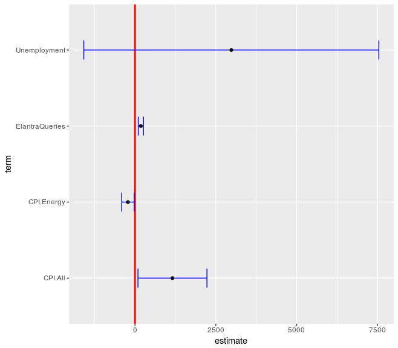
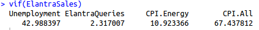
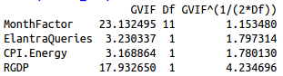

# Forecasting Automobile Sales with Linear Regression in R

**Topic:** Time series forecasting, feature selection, linear regression  
**Language:** R  
**Level:** Introductory - Intermediate  

---

## What You Will Learn

By working through this project you will be able to:

- Split time series data into training and test sets correctly
- Build a linear regression model in R using `lm()`
- Interpret model summaries: coefficients, p-values, R-squared
- Use **Variable Inflation Factor (VIF)** to detect multicollinearity among predictors
- Use **confidence interval plots** (`ggcoef`) to visually assess which predictors matter
- Iteratively refine a model by dropping weak predictors
- Add a **seasonality** component to improve forecast accuracy
- Evaluate forecast quality using **Out-of-Sample R-squared (OSR2)**
- Apply a final model to make a real prediction

---

## The Problem

Nearly all companies need to predict future demand for their products. Accurate sales forecasts let manufacturers match production to demand - reducing inventory costs while avoiding stockouts.

Here, we predict **monthly U.S. sales of the Hyundai Elantra** using:
- U.S. macroeconomic indicators (unemployment, consumer price indices)
- Google search query volume for "Elantra" (a proxy for consumer interest)
- Month-of-year (to capture seasonal buying patterns)
- Real GDP (explored as an alternative predictor)

---

## Data

| File | Description |
|---|---|
| `Elantra142-Fall2017.csv` | Core dataset: monthly sales + economic indicators (2010-2017) |
| `Elantra142-Fall2017-RGDP.csv` | Adds a numeric month index and month factor for seasonality analysis |
| `Elantra142-Fall2017-RGDP2.csv` | Adds Real GDP (RGDP) as an alternative predictor |
| `multiTimeline.csv` | Google Trends data for Elantra search volume |

**Key columns:**
- `ElantraSales` - monthly units sold (the target variable)
- `Unemployment` - U.S. unemployment rate
- `ElantraQueries` - normalized Google search volume
- `CPI.Energy` - Consumer Price Index for energy
- `CPI.All` - Consumer Price Index for all goods
- `MonthFactor` - month as a categorical variable (Jan through Dec)
- `RGDP` - Real Gross Domestic Product

**Train/test split:** Data from 2010-2014 is used for training. Data from 2015-2017 is held out for testing. This is the correct way to evaluate a time series model - you never train on the future.

---

## Workflow Overview

```
Raw data
   |
   +--> Split by year (train: 2010-2014 / test: 2015-2017)
   |
   +--> Build naive model (4 predictors)
   |       |
   |       +--> Check VIF + confidence intervals
   |       +--> Drop weak/collinear predictors
   |       +--> Evaluate OSR2
   |
   +--> Add seasonality (MonthFactor)
   |       |
   |       +--> Iterate to remove collinear terms
   |       +--> Evaluate OSR2
   |
   +--> Build combined model (best subset)
   |       +--> Evaluate OSR2
   |
   +--> Explore RGDP as predictor
   |
   +--> Predict August 2017 sales
```

---

## Step-by-Step Walkthrough

### Step 1 - Load Data and Split by Time

```r
elantra <- read.csv("Elantra142-Fall2017.csv")

elantra.train <- filter(elantra, Year < 2015)
elantra.test  <- filter(elantra, Year > 2014)
```

**Why split by year and not randomly?** In time series, the future cannot be used to predict the past. A random split would allow the model to "see" 2016 data while predicting 2013 - that's data leakage, and it would inflate your accuracy numbers artificially.

---

### Step 2 - Naive Linear Regression Model

```r
ElantraSales <- lm(ElantraSales ~ Unemployment + ElantraQueries + CPI.Energy + CPI.All,
                   data = elantra.train)
summary(ElantraSales)
```

`lm(Y ~ X1 + X2 + ..., data = ...)` fits a linear model: it finds the coefficients that minimize the sum of squared residuals across the training data.

`summary()` tells you:
- **Estimate** - the fitted coefficient for each predictor
- **Pr(>|t|)** - p-value; small values (< 0.05) suggest a predictor is statistically significant
- **R-squared** - proportion of variance in the target explained by the model

**Confidence interval plot (naive model):**



Each bar shows the 95% confidence interval for a coefficient. If a bar crosses zero (the red line), that predictor is not reliably nonzero - it may not be contributing useful signal.

---

### Step 3 - Check for Multicollinearity with VIF

```r
vif(ElantraSales)
```

**Variance Inflation Factor (VIF)** measures how much each predictor's coefficient estimate is inflated due to correlation with other predictors. As a rule of thumb:
- VIF < 5: acceptable
- VIF 5-10: moderate concern
- VIF > 10: high multicollinearity, consider removing the predictor



If two predictors are highly correlated (e.g., `CPI.Energy` and `CPI.All` both measure prices), keeping both hurts the model's interpretability and stability.

---

### Step 4 - Narrow the Model

Drop predictors that are insignificant or collinear based on Step 2 and Step 3:

```r
sub_ElantraSales <- lm(ElantraSales ~ ElantraQueries + CPI.All, data = elantra.train)
summary(sub_ElantraSales)
```




---

### Step 5 - Evaluate on the Test Set (OSR2)

```r
predictions_ElantraSales <- predict(sub_ElantraSales, newdata = elantra.test)

SSE_a <- sum((elantra.test$ElantraSales - predictions_ElantraSales)^2)
SST_a <- sum((elantra.test$ElantraSales - mean(elantra.train$ElantraSales))^2)
OSR2_a <- 1 - SSE_a / SST_a
```

**Out-of-Sample R-squared (OSR2)** is the key metric here. Unlike the in-sample R-squared from `summary()`, OSR2 tells you how well the model generalizes to data it has never seen.

- `SSE` = sum of squared errors from your model (how wrong your predictions are)
- `SST` = sum of squared errors from the **baseline** (just predicting the training mean every time)
- `OSR2 = 1 - SSE/SST`: if your model beats the baseline, OSR2 > 0; if it's worse, OSR2 < 0

---

### Step 6 - Add Seasonality

Car sales have a strong seasonal pattern - people buy more cars in spring and summer. We can capture this by adding `MonthFactor` (a categorical variable for each month) as a predictor.

```r
seasonal_ES <- lm(ElantraSales ~ MonthFactor + Unemployment +
                    ElantraQueries + CPI.Energy + CPI.All, data = elantra.train)
```

**EDA - Sales by Month:**


This scatter plot shows each month colored differently. The visual clustering confirms that month of year is a meaningful signal worth including.


---

### Step 7 - Iterate to Remove Collinear Terms

With `MonthFactor` now in the model, some of the economic predictors become redundant (e.g., `Unemployment` moves seasonally too). Re-check VIF and drop terms iteratively:

```r
# Remove Unemployment
seasonal_ES2 <- lm(ElantraSales ~ MonthFactor + ElantraQueries + CPI.Energy + CPI.All,
                   data = elantra.train)

# Remove CPI.Energy
seasonal_ES3 <- lm(ElantraSales ~ MonthFactor + ElantraQueries + CPI.All,
                   data = elantra.train)
```


---

### Step 8 - Combined Model

Taking the best features discovered across experiments:

```r
combination_ES <- lm(ElantraSales ~ MonthFactor + CPI.All, data = elantra.train)
```


Evaluate OSR2 for each model and compare. The model with the highest OSR2 on the test set is the best generalizer.

---

### Step 9 - Explore RGDP as a Predictor

```r
elantra3 <- read.csv("Elantra142-Fall2017-RGDP2.csv")

custom_ES3 <- lm(ElantraSales ~ MonthFactor + ElantraQueries + CPI.Energy + RGDP,
                 data = elantra3.train)
```


Real GDP is a broader economic indicator than CPI. This section explores whether it adds predictive power or introduces redundancy.

---

### Step 10 - Make a Real Prediction

Using the best-performing model, predict Elantra sales for **August 2017**:

```r
Aug2017_ES_combined <- ((-84309.21) - 7011.47*(0) - 5063.52*(0) + 446.33*(0) + 416.636*(0)
                        - 496.86*(0) + 696.16*(0) - 2.97*(1) - 3122.47*(0) - 6600.71*(0)
                        - 6039.35*(0) - 2505.80*(0) + 452.00*(244.03))
Error <- abs(Aug2017_ES_combined - 15127)
```

The `MonthFactor` coefficients act as binary switches (0 or 1) for each month. August gets a 1 in its slot; all others get 0. `CPI.All` is plugged in as the average value observed Jan-Jul 2017 (244.03).

---

## How to Run This

1. Open RStudio (or any R environment)
2. Set your working directory to this folder: `setwd("path/to/Forecasting_Using_R")`
3. Open `forecasting_auto_sales.R`
4. Run the script top to bottom - each section builds on the last

The script will automatically create the `images/` directory and save all plots there.

**Required packages** (install once):
```r
install.packages(c("dplyr", "ggplot2", "GGally", "car"))
```

---

## Key Concepts Glossary

| Term | Meaning |
|---|---|
| `lm()` | R function for fitting linear regression models |
| Residual | The difference between predicted and actual value |
| SSE | Sum of Squared Errors - total prediction error |
| SST | Total Sum of Squares - error of a naive baseline |
| OSR2 | Out-of-Sample R-squared - how well the model generalizes |
| VIF | Variance Inflation Factor - detects multicollinearity |
| `MonthFactor` | Month encoded as a categorical (dummy) variable |
| Multicollinearity | When two or more predictors are highly correlated |
| Seasonality | Repeating patterns tied to time of year |

---

## Further Reading

- *Introduction to Statistical Learning* - Chapter 3 for linear regression foundations
- *Forecasting: Principles and Practice* - free online at otexts.com/fpp3
- R documentation: `?lm`, `?vif`, `?ggcoef`

---

## Credits and Acknowledgements

This project was originally developed as a course assignment in an introductory machine learning class (Fall 2017). The problem structure - predicting Hyundai Elantra sales using economic indicators and search query data - was adapted from a textbook exercise on applied regression.

Recommended textbooks referenced throughout this walkthrough:
- James, G., Witten, D., Hastie, T., and Tibshirani, R. - *An Introduction to Statistical Learning*
- Hyndman, R.J. and Athanasopoulos, G. - *Forecasting: Principles and Practice*

---

## Contact

<div align="center">
  

  <sub>ehcastroh</sub>

  <a href="https://github.com/ehcastroh">GitHub</a> · <a href="https://www.linkedin.com/in/ehcastroh/">LinkedIn</a>
</div>
